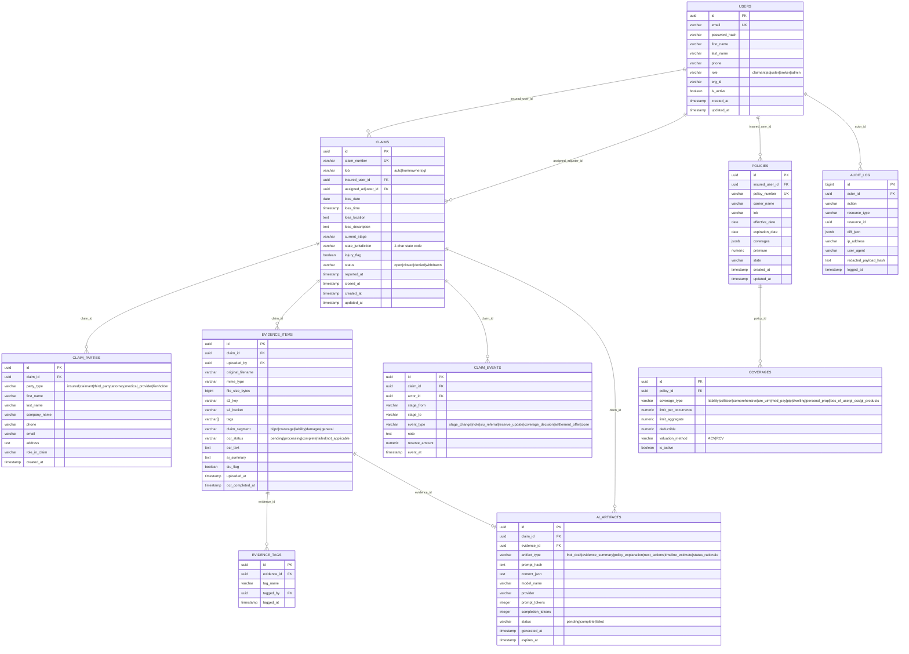

# Data Model — Insurance Claim Assistant

**Version:** 1.0  
**Database:** PostgreSQL 16 (SQLite for local dev)

---

## 1. ERD (Mermaid)



---

## 2. Table Definitions

### 2.1 `users`

| Column | Type | Nullable | Default | Notes |
|--------|------|----------|---------|-------|
| `id` | UUID | NOT NULL | gen_random_uuid() | PK |
| `email` | VARCHAR(255) | NOT NULL | — | UNIQUE; used as login |
| `password_hash` | VARCHAR(255) | NOT NULL | — | bcrypt; NULL if SSO-only |
| `first_name` | VARCHAR(100) | NOT NULL | — | |
| `last_name` | VARCHAR(100) | NOT NULL | — | |
| `phone` | VARCHAR(20) | NULL | — | E.164 format |
| `role` | VARCHAR(20) | NOT NULL | 'claimant' | ENUM: claimant, adjuster, broker, admin |
| `org_id` | VARCHAR(100) | NULL | — | Carrier/org identifier for multi-tenant readiness |
| `is_active` | BOOLEAN | NOT NULL | TRUE | Soft delete flag |
| `created_at` | TIMESTAMPTZ | NOT NULL | NOW() | |
| `updated_at` | TIMESTAMPTZ | NOT NULL | NOW() | Trigger-maintained |

**Indexes:** `idx_users_email` UNIQUE, `idx_users_role`  
**Security:** `email` stored plaintext; `phone`, future SSN stored encrypted (pgcrypto)

---

### 2.2 `claims`

| Column | Type | Nullable | Default | Notes |
|--------|------|----------|---------|-------|
| `id` | UUID | NOT NULL | gen_random_uuid() | PK |
| `claim_number` | VARCHAR(20) | NOT NULL | — | UNIQUE; format `CLM-2025-000001` |
| `lob` | VARCHAR(20) | NOT NULL | — | auto \| homeowners \| gl |
| `insured_user_id` | UUID | NOT NULL | — | FK → users.id |
| `assigned_adjuster_id` | UUID | NULL | — | FK → users.id (role=adjuster) |
| `loss_date` | DATE | NOT NULL | — | Date of loss/occurrence |
| `loss_time` | TIMESTAMPTZ | NULL | — | Best-known time of loss |
| `loss_location` | TEXT | NOT NULL | — | Street address or description |
| `loss_description` | TEXT | NULL | — | Free-form narrative (from FNOL) |
| `current_stage` | VARCHAR(50) | NOT NULL | 'reported' | FSM state |
| `state_jurisdiction` | CHAR(2) | NOT NULL | — | US state code (e.g., 'NC') |
| `injury_flag` | BOOLEAN | NOT NULL | FALSE | BI indicator; triggers HIPAA handling |
| `status` | VARCHAR(20) | NOT NULL | 'open' | open \| closed \| denied \| withdrawn |
| `reported_at` | TIMESTAMPTZ | NOT NULL | NOW() | FNOL timestamp |
| `closed_at` | TIMESTAMPTZ | NULL | — | Set on status='closed' |
| `lob_metadata` | JSONB | NULL | — | LOB-specific fields (VIN, peril, etc.) |
| `created_at` | TIMESTAMPTZ | NOT NULL | NOW() | |
| `updated_at` | TIMESTAMPTZ | NOT NULL | NOW() | |

**Indexes:** `idx_claims_claim_number` UNIQUE, `idx_claims_insured_user_id`, `idx_claims_assigned_adjuster_id`, `idx_claims_current_stage`, `idx_claims_lob`, `idx_claims_state_jurisdiction`

**LOB metadata JSONB examples:**
```json
// Auto
{
  "vin": "1HGBH41JXMN109186",
  "make": "Honda",
  "model": "Accord",
  "year": 2021,
  "plate": "ABC-1234",
  "police_report_number": "PR-2025-00471",
  "at_fault_party": "third_party",
  "damage_type": ["PD", "BI"]
}

// Homeowners
{
  "peril": "water",
  "affected_areas": ["kitchen", "basement"],
  "occupancy_type": "owner_occupied",
  "mortgagee": "Wells Fargo Bank NA",
  "loan_number": "WF-4521887"
}

// General Liability
{
  "coverage_trigger": "occurrence",
  "incident_type": "slip_and_fall",
  "premises": "retail_store",
  "alleged_injury": true,
  "alleged_property_damage": false
}
```

---

### 2.3 `claim_parties`

| Column | Type | Nullable | Notes |
|--------|------|----------|-------|
| `id` | UUID | NOT NULL | PK |
| `claim_id` | UUID | NOT NULL | FK → claims.id |
| `party_type` | VARCHAR(30) | NOT NULL | insured, claimant, third_party, attorney, medical_provider, lienholder |
| `first_name` | VARCHAR(100) | NULL | |
| `last_name` | VARCHAR(100) | NULL | |
| `company_name` | VARCHAR(200) | NULL | For medical providers, law firms |
| `phone` | VARCHAR(20) | NULL | |
| `email` | VARCHAR(255) | NULL | |
| `address` | TEXT | NULL | |
| `role_in_claim` | VARCHAR(100) | NULL | e.g., "Adverse driver", "Claimant attorney" |
| `created_at` | TIMESTAMPTZ | NOT NULL | |

**Indexes:** `idx_claim_parties_claim_id`

---

### 2.4 `policies`

| Column | Type | Nullable | Notes |
|--------|------|----------|-------|
| `id` | UUID | NOT NULL | PK |
| `insured_user_id` | UUID | NOT NULL | FK → users.id |
| `policy_number` | VARCHAR(50) | NOT NULL | UNIQUE; encrypted at rest in prod |
| `carrier_name` | VARCHAR(200) | NOT NULL | |
| `lob` | VARCHAR(20) | NOT NULL | |
| `effective_date` | DATE | NOT NULL | |
| `expiration_date` | DATE | NOT NULL | |
| `coverages` | JSONB | NULL | Denormalized coverage summary |
| `premium` | NUMERIC(10,2) | NULL | Annual premium |
| `state` | CHAR(2) | NOT NULL | |
| `created_at` | TIMESTAMPTZ | NOT NULL | |
| `updated_at` | TIMESTAMPTZ | NOT NULL | |

**Indexes:** `idx_policies_policy_number` UNIQUE, `idx_policies_insured_user_id`

---

### 2.5 `coverages`

| Column | Type | Nullable | Notes |
|--------|------|----------|-------|
| `id` | UUID | NOT NULL | PK |
| `policy_id` | UUID | NOT NULL | FK → policies.id |
| `coverage_type` | VARCHAR(50) | NOT NULL | See coverage_type ENUM below |
| `limit_per_occurrence` | NUMERIC(12,2) | NULL | |
| `limit_aggregate` | NUMERIC(12,2) | NULL | |
| `deductible` | NUMERIC(10,2) | NULL | |
| `valuation_method` | VARCHAR(5) | NULL | ACV or RCV |
| `is_active` | BOOLEAN | NOT NULL | TRUE |

**coverage_type values:** `liability_bodily_injury`, `liability_property_damage`, `collision`, `comprehensive`, `um_uim_bi`, `um_uim_pd`, `med_pay`, `pip`, `dwelling_a`, `other_structures_b`, `personal_property_c`, `loss_of_use_d`, `liability_e`, `med_pay_f`, `gl_occurrence`, `gl_products_completed_ops`, `gl_personal_advertising`

---

### 2.6 `evidence_items`

| Column | Type | Nullable | Notes |
|--------|------|----------|-------|
| `id` | UUID | NOT NULL | PK |
| `claim_id` | UUID | NOT NULL | FK → claims.id |
| `uploaded_by` | UUID | NOT NULL | FK → users.id |
| `original_filename` | VARCHAR(500) | NOT NULL | |
| `mime_type` | VARCHAR(100) | NOT NULL | |
| `file_size_bytes` | BIGINT | NOT NULL | |
| `s3_key` | VARCHAR(1000) | NOT NULL | Full S3 object key |
| `s3_bucket` | VARCHAR(100) | NOT NULL | |
| `tags` | VARCHAR(50)[] | NOT NULL | DEFAULT '{}' |
| `claim_segment` | VARCHAR(30) | NOT NULL | bi, pd, coverage, liability, damages, general |
| `ocr_status` | VARCHAR(20) | NOT NULL | pending, processing, complete, failed, not_applicable |
| `ocr_text` | TEXT | NULL | Raw OCR output |
| `ai_summary` | TEXT | NULL | LLM-generated summary |
| `siu_flag` | BOOLEAN | NOT NULL | FALSE; set by AI or adjuster |
| `uploaded_at` | TIMESTAMPTZ | NOT NULL | |
| `ocr_completed_at` | TIMESTAMPTZ | NULL | |

**Indexes:** `idx_evidence_items_claim_id`, `idx_evidence_items_ocr_status`, `idx_evidence_items_tags` GIN index on array

---

### 2.7 `claim_events`

| Column | Type | Nullable | Notes |
|--------|------|----------|-------|
| `id` | UUID | NOT NULL | PK |
| `claim_id` | UUID | NOT NULL | FK → claims.id |
| `actor_id` | UUID | NOT NULL | FK → users.id |
| `stage_from` | VARCHAR(50) | NULL | NULL for initial reported event |
| `stage_to` | VARCHAR(50) | NULL | Set for stage_change events |
| `event_type` | VARCHAR(50) | NOT NULL | stage_change, note, siu_referral, reserve_update, coverage_decision, settlement_offer, close |
| `note` | TEXT | NULL | |
| `reserve_amount` | NUMERIC(12,2) | NULL | Set for reserve_update events |
| `event_at` | TIMESTAMPTZ | NOT NULL | NOW() |

**Indexes:** `idx_claim_events_claim_id`, `idx_claim_events_event_at`

**Valid stage transitions:**
```
reported → investigation
investigation → coverage_evaluation
investigation → closed (denial without coverage issue)
coverage_evaluation → liability_damages
coverage_evaluation → closed (coverage denial)
liability_damages → settlement_negotiation
settlement_negotiation → closed
Any stage → closed (exceptional circumstances, logged)
```

---

### 2.8 `ai_artifacts`

| Column | Type | Nullable | Notes |
|--------|------|----------|-------|
| `id` | UUID | NOT NULL | PK |
| `claim_id` | UUID | NULL | FK → claims.id |
| `evidence_id` | UUID | NULL | FK → evidence_items.id |
| `artifact_type` | VARCHAR(50) | NOT NULL | fnol_draft, evidence_summary, policy_explanation, next_actions, timeline_estimate, status_rationale |
| `prompt_hash` | VARCHAR(64) | NOT NULL | SHA-256 of redacted prompt (for dedup/cache) |
| `content_json` | JSONB | NOT NULL | Structured LLM output |
| `model_name` | VARCHAR(100) | NOT NULL | e.g., gpt-4o, claude-3-5-sonnet |
| `provider` | VARCHAR(50) | NOT NULL | openai, anthropic, mock |
| `prompt_tokens` | INTEGER | NULL | |
| `completion_tokens` | INTEGER | NULL | |
| `status` | VARCHAR(20) | NOT NULL | pending, complete, failed |
| `generated_at` | TIMESTAMPTZ | NOT NULL | |
| `expires_at` | TIMESTAMPTZ | NULL | For cached policy explanations |

**Indexes:** `idx_ai_artifacts_claim_id`, `idx_ai_artifacts_evidence_id`, `idx_ai_artifacts_artifact_type`, `idx_ai_artifacts_prompt_hash`

---

### 2.9 `audit_log`

| Column | Type | Nullable | Notes |
|--------|------|----------|-------|
| `id` | BIGSERIAL | NOT NULL | PK (large sequential for fast append) |
| `actor_id` | UUID | NULL | FK → users.id; NULL for system actions |
| `action` | VARCHAR(100) | NOT NULL | e.g., `claim.create`, `evidence.upload`, `ai.generate` |
| `resource_type` | VARCHAR(50) | NOT NULL | claim, evidence, policy, user |
| `resource_id` | UUID | NULL | |
| `diff_json` | JSONB | NULL | Before/after for updates |
| `ip_address` | INET | NULL | |
| `user_agent` | TEXT | NULL | |
| `redacted_payload_hash` | VARCHAR(64) | NULL | SHA-256 of redacted payload for integrity |
| `logged_at` | TIMESTAMPTZ | NOT NULL | NOW() |

**Indexes:** `idx_audit_log_actor_id`, `idx_audit_log_resource_type_id`, `idx_audit_log_logged_at` (BRIN for time-series efficiency)

**Retention:** 7 years minimum (GLBA requirement); implement partitioning by year after year 1.

---

## 3. Sequences & Generated Values

```sql
-- Claim number sequence
CREATE SEQUENCE claim_number_seq START 1;

-- Generated claim number
CREATE OR REPLACE FUNCTION generate_claim_number() RETURNS TEXT AS $$
BEGIN
  RETURN 'CLM-' || TO_CHAR(NOW(), 'YYYY') || '-' || LPAD(NEXTVAL('claim_number_seq')::TEXT, 6, '0');
END;
$$ LANGUAGE plpgsql;
```

---

## 4. Key Constraints & Business Rules

```sql
-- Valid LOB values
ALTER TABLE claims ADD CONSTRAINT chk_claims_lob 
  CHECK (lob IN ('auto', 'homeowners', 'gl'));

-- Valid status values  
ALTER TABLE claims ADD CONSTRAINT chk_claims_status 
  CHECK (status IN ('open', 'closed', 'denied', 'withdrawn'));

-- Valid stage values
ALTER TABLE claims ADD CONSTRAINT chk_claims_stage 
  CHECK (current_stage IN (
    'reported', 'investigation', 'coverage_evaluation',
    'liability_damages', 'settlement_negotiation', 'closed'
  ));

-- Valuation method
ALTER TABLE coverages ADD CONSTRAINT chk_coverages_valuation 
  CHECK (valuation_method IN ('ACV', 'RCV') OR valuation_method IS NULL);

-- Evidence segment
ALTER TABLE evidence_items ADD CONSTRAINT chk_evidence_segment
  CHECK (claim_segment IN ('bi', 'pd', 'coverage', 'liability', 'damages', 'general'));
```
